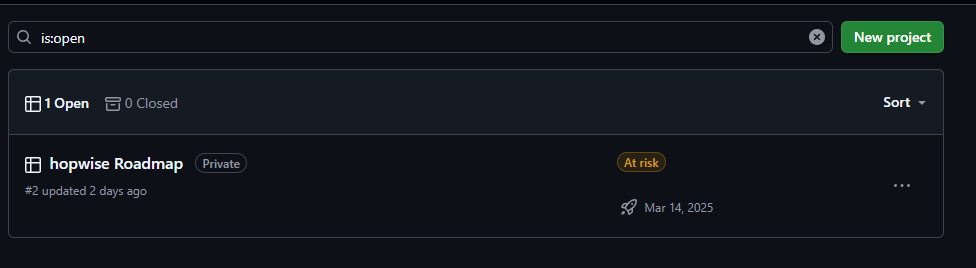

# Introduzione a Git e GitHub

<!-- New section -->

## Sommario

1. Introduzione a Git
- Cos'è Git? Concetti base e architettura
- Flusso di lavoro con Git: Creazione di un repository
- Monitorazione working tree
- Versioni ramificate (branch) e riunificate (merge)
- Repository remoto
- Vincoli di versioning (.gitignore)
- Risoluzione problemi

<!-- New subsection -->

2. Introduzione a GitHub
- Cos'è GitHub? Che alternative esistono?
- Creazione di un nuovo repository
- README e LICENSE
- Collaborazione (Issues e Pull Requests)
- Progettazione e Automazione (Workflow e Project)

<!-- New section -->

# Introduzione a Git

<!-- New section -->

## Cos'è Git? Concetti base e architettura

Git è un sistema di controllo di versione, o semplicemente detto sistema di _versioning_.

Permette quindi di gestire varie versioni dei dati e contenuti, da piccoli a grandi progetti con velocità ed efficienza.

Con _versione_ si intende lo stato dei dati in un certo momento, come un insieme di modifiche, a cui viene tipicamente assegnato un identificativo, es. v0.1.1 o beta-0.9.7a. Il numero di versione segue spesso degli standard, come il [Semantic Versioning(SemVer)](https://semver.org/).

<!-- .element: class="fragment" -->

<!-- New subsection -->

### Git History

Queste diverse versioni dei file generano uno storico, di cui ogni elemento è detto _snapshot_, ovvero una fotografia dello stato dei file.


<p style='text-align: left; font-size: 8px'>Immagine presa da Pro Git Book <a>https://git-scm.com/book/en/v2</a></p>

<!-- New subsection -->

### Architettura

Git gestisce il versioning dei file tramite un'architettura a 3 fasi:
- **Working**: file ancora manipolati e in modifica
- **Staging**: file _aggiunti_ pronti per essere inclusi in una nuova versione
- **Repository**: contiene e gestisce tutte le versioni create


<p style='text-align: left; font-size: 8px'>Immagine presa da Pro Git Book <a>https://git-scm.com/book/en/v2</a></p>

<!-- New subsection -->

### Ciclo di vita dei file

I file hanno un vero e proprio ciclo di vita nella propria working directory (o _working tree_).


<p style='text-align: left; font-size: 8px'>Immagine presa da Pro Git Book <a>https://git-scm.com/book/en/v2</a></p>

<!-- New subsection -->

- **Tracking**: identifica se i file sono tracciati da Git (no versioning)
- **Unmodified**: file tracciati, ma non modificati
- **Modified**: file tracciati, ma modificati
- **Staged**: file pronti per essere aggiunti alla prossima versione

<!-- New section -->

## Flusso di lavoro con Git: Creazione di un repository

<!-- New subsection -->

`git init`: inizializzare un nuovo progetto git nella cartella attuale (crea una cartella _.git_)


<!-- New subsection -->

Creiamo un file _README.md_ (file Markdown), tipicamente usato dalla maggior parte dei repository per descrivere il progetto.<br>
Il comando `git add` permette di aggiungere i file alla fase di staging. Nuovi file inizeranno a essere tracciati da Git per il versioning.

- `git add FILE[s]`: permette di aggiungere file specifici
- `git add .`: aggiunge tutti i file presenti nella cartella, comprese sottocartelle (usare con cautela)
- `git add -u`: aggiunge i file tracciati e modificati (da usare il più delle volte)

<!-- .element: class="fragment" data-fragment-index="1" -->


<!-- .element: class="fragment" data-fragment-index="1" -->

<!-- New subsection -->

Il comando _commit_ (impegno) è un comando fondamentale in Git e serve per aggiungere un file al repository dalla fase di staging. Una volta usato i file sono stati inclusi nell'ultima versione e i file coinvolti tornano allo stato di **Unmodified**.

- `git commit -m "breve sommario"`: creazione di una nuova versione (snapshot) nel repository con un breve messaggio
- `git commit -m "breve sommario" -m "messaggio commit molto molto lungo"`: breve messaggio + messaggio lungo

<!-- .element: class="fragment" data-fragment-index="1" -->


<!-- .element: class="fragment" data-fragment-index="1" -->

<!-- New subsection -->

Vari `git add` e `git commit` generano una catena di versioni, in cui tipicamente l'ultima aggiunta è la versione attuale dei propri file. Essa è la testa del nostro ramo di versioni.

<!-- .element: class="fragment"  -->

Questo aspetto è importante perché Git associa una referenza simbolica, chiamata **HEAD**, che punta alla tua posizione nello storico dei commit.<br>
A ogni commit (creazione di versione), **HEAD** si sposta, tipicamente tenendo traccia della "testa" del ramo di versioni.

<!-- New section -->

## Monitorazione working tree

È spesso necessario controllare e verificare che i nostri comandi Git siano applicati ai file giusti e controllare che sia tutto in ordine.<br>
Esistono alcuni comandi utili per monitorare il ciclo di vita del software e gestire il repository.

<!-- New subsection -->

`git status`: elenca dall'alto verso il basso i) i file che presentano differenze tra l'indice (area di staging) e l'HEAD attuale, ii) i file che presentando differenze tra l'indice (area di staging) e il workspace (working tree), iii) i file del workspace che non sono tracciati da Git.


<!-- New subsection -->

`git diff`: elenca le **differenze** fra il workspace e l'indice (area di staging).


<!-- New subsection -->

`git log`: elenca gli ultimi commit, i più recenti in cima. L'output può essere personalizzato con i parametri --decorate, --stat (aggiunge statistiche), --author (filtra per autore), --after e --before (filtra per date)


<!-- New section -->

## Branching e Merging

<!-- New subsection -->

Una delle feature più importanti di Git è la sua gestione del _branching_ (ramificazione), ovvero la gestione dei "rami" di dati, in cui ogni ramo deriva da un ramo radice.


Git permette di spostarsi localmente da un ramo all'altro in maniera rapida, modificando il working tree per lavorare su un altro branch.

<!-- .element: class="fragment" -->

<!-- New subsection -->

Perché usare il branching?

- Testare un'idea per sperimentarla attentamente prima di includerla nella codebase principale
- Implementare ogni nuova feature in un suo branch dedicato
- Suddividere i branch per lo scopo finale (produzione, development)
- Gestire meglio i conflitti tra sviluppatori per modifiche su porzioni di codice dipendenti

<!-- New subsection -->

- `git branch` / `git branch --list`: mostra i branch disponibili e quello attuale
- `git branch <altro-branch>`: crea un nuovo branch, copiando il contenuto del branch attuale (tipicamente chiamato **master** o **main**)
- `git switch <altro-branch>`: ci si sposta dal branch attuale a _NOME\_NUOVO\_BRANCH_ (può dare problemi con file modificati)
- `git branch -d <branch>`: cancella un branch

NOTA: il comando `checkout` ha lo stesso effetto di `switch` e potrebbe essere usato in qualche guida, sebbene venga sconsigliato da alcuni.

<!-- .element: class="fragment" -->


<!-- New subsection -->

Il merging è un'operazione complementare del branching, in cui i contenuti di rami diversi vengono uniti insieme.<br>
Esempio: si implementa una nuova funzionalità su un branch _nuova\_feature_ e una volta pronta si unisce al codice principale sul branch _master_.

<!-- New subsection -->

`git merge <altro-branch>`: i contenuti dei file in _ALTRO\_BRANCH_ vengono fusi con quelli del branch attuale


<!-- New subsection -->

E se i due rami includono gli stessi file modificati ma con modifiche diverse?

Ci troviamo potenzialmente di fronte a dei _conflitti_, perché Git non può autonomamente decidere se deve mantenere la versione del file contenuta in un branch o nell'altro.

<!-- .element: class="fragment" data-fragment-index="1" -->


<!-- .element: class="fragment" data-fragment-index="1" -->

<!-- New subsection -->

Bisogna quindi risolvere questi conflitti. Seguendo le [linee guida](https://git-scm.com/docs/git-merge#_how_to_resolve_conflicts) di Git, abbiamo diverse soluzioni:

- `git mergetool`: apre un tool grafico per eseguire il merge
- `git diff`: visualizza le differenze fra i due branch. Aprire manualmente il file è la stessa cosa
- `git diff <branch-attuale>..<altro-branch>`: visualizzazione un po' più carina del semplice `git diff`
- usare tool più avanzati forniti da IDE come VSCode o PyCharm

<!-- New subsection -->

Vediamo il metodo più semplice, ovvero modificare il file.


La version del branch _nuova\_feature_ sembra migliore. Cancelliamo tutto e teniamo solo il contenuto fra "======" e ">>>>>>>> nuova_feature".

<!-- .element: class="fragment" data-fragment-index="1" -->

<!-- New subsection -->

Lo stesso `git status` ci dice che abbiamo dei "path" (branch) di cui dobbiamo ancora fare il merge.


<!-- New subsection -->

Dopo aver aggiunto i file alla fase di staging l'output di `git status` ci avvisa che i conflitti sono risolti, ma siamo ancora nella fase di merging.


Come suggerito, il merge si conclude con `git commit`, il cui messaggio è detto messaggio di merging.

<!-- .element: class="fragment" -->

<!-- New subsection -->

A volte può capitare di dover cambiare branch dopo aver fatto le modifiche oppure di salvare delle modifiche per usarle in un altro momento.

In questi casi è molto utile il comando `git stash`, che ci permette di salvare le modifiche attuali in un "magazzino locale" e assegna a ogni salvataggio un ID (nell'immagine _stash@{0}_ o semplicemente 0).

<!-- .element: class="fragment" data-fragment-index="1" -->


<!-- .element: class="fragment" data-fragment-index="1" -->

<!-- .element: class="fragment" -->

<!-- New subsection -->

- `git stash`: salva le modifiche locali e resettare il working tree allo stato dell'HEAD
- `git stash apply`: applica le modifiche salvate nell'ultimo stash
- `git stash list`: mostra la lista dei salvataggi effettuati con git stash
- `git stash drop [<stash>]`: rimuove il salvataggio specificato da _<stash>_
- `git stash pop`: applica le modifiche dell'ultimo stash e le rimuove dalla lista degli stash (equivalente a `git stash apply` + `git stash drop`)

<!-- New section -->

## Repository remoto

Git è tipicamente usato con un layer aggiuntivo, un repository remoto. Esso è raggiungibile e modificabile da diverse macchine, permettendo una gestione condivisa e distribuita dei contenuti soggetti a versioning.

Le operazioni principali che si eseguono con un repository remoto sono l'upload delle proprie modifiche (_push_) e il download di modifiche fatte da altri client (_pull_).

<!-- .element: class="fragment" -->

<!-- New subsection -->

Ipotizziamo di avere a disposizione un server Git raggiungibile all'indirizzo `git.ourcompany.com` ed esso contenga un progetto su cui vogliamo lavorare, chiamato **project**.

Il primo comando importante da imparare con repository remoti è `git clone <url>`, che permette di copiare (clonare) da _url_ un progetto tracciato da Git nella propria directory.

<!-- .element: class="fragment" -->

Col nostro esempio, il comando completo sarebbe `git clone jackmedda@git.ourcompany.com:project.git`

<!-- .element: class="fragment" -->

<!-- New subsection -->

Git assegna dei nomi di riferimento per gestire le varie informazioni. Come _master_ viene usato per il branch principale, **origin/master** viene usato per il branch principale nel repository remoto, dove **origin** rappresenta il repository remoto.


<p style='text-align: left; font-size: 8px'>Immagine presa da Pro Git Book <a>https://git-scm.com/book/en/v2</a></p>

<!-- New subsection -->

Più repository remoti possono essere assegnati e gestiti sullo stesso progetto, ma non tratteremo questo caso più elaborato e può personalmente essere consultato dal Git Book.

<!-- New subsection -->

Come aggiorno il repository remoto dopo aver fatto le mie modifiche e averle aggiunte tramite commit al repository locale?

`git push <remote> <branch>`: esegue l'upload del proprio branch master sul server remoto, es. `git push origin master`.

<!-- .element: class="fragment" data-fragment-index="1" -->


<!-- .element: class="fragment" data-fragment-index="1" -->

<!-- New subsection -->

Il recupero di modifiche e dati aggiornati dal repository remoto viene gestito principalmente da due comandi:

- `git fetch <remote>`: recupera le referenze delle nuove informazioni sul repository remoto aggiornando il tracking locale di Git. NON MODIFICA I FILE LOCALI

<!-- .element: class="fragment" data-fragment-index="1" -->

- `git pull <remote> <branch>`: coincide con un comando `git fetch` seguito da `git merge`. Quindi MODIFICA I FILE LOCALI aggiornandoli con la versione remota.

<!-- .element: class="fragment" data-fragment-index="2" -->


<!-- .element: class="fragment" data-fragment-index="1" -->

<!-- New section -->

## Vincoli di versioning (.gitignore)

Quando lavoriamo con Git capita spesso che dei file vengano generati o che siano inclusi nella cartella, ma non sia necessario che vengano tracciati da Git.

Alcuni esempi sono `__pycache__` (cartella con script Python precompilati), `.idea` (file di configurazione per progetti PyCharm), file di log, ecc.

<!-- .element: class="fragment" -->

I problemi maggiori nascono quando viene usato il comando `git add .` che istruisce Git a tracciare TUTTI i file nella cartella.

<!-- .element: class="fragment" -->

<!-- New subsection -->

Fortunatamente, esiste un modo per ignorare alcuni file in maniera deterministica.<br>
È il caso del file _.gitignore_.


<!-- New subsection -->

L'aggiunta di questo file nella cartella del progetto avvisa Git che tutti i file e cartelle inclusi in gitignore sono da ignorare.

Il pattern matching dei nomi delle cartelle segue regole delle espressioni regolari (regex), come `*.so` per ignorare tutti i file con estensione ".so" o `*.py[cod]` per ignorare tutti i file con estensione ".pyc", ".pyo", ".pyd".

<!-- .element: class="fragment" -->

Dunque, il file .gitignore limita il comando `git add .` ignorando i file identificati dal pattern matching.

<!-- .element: class="fragment" -->

<!-- New section -->

## Risoluzione problemi

Sbagliare può capitare a tutti e Git fornisce strumenti per tornare indietro o risolvere comuni problemi.

Errori comuni sono commit fatti per sbaglio oppure file aggiunti erroneamente all'area di staging.

<!-- New subsection -->

- `git commit --amend`: annullare un commit per poter fare modifiche, come aggiungere file o cambiare messaggio di commit
- `git restore --staged <file>` / `git reset HEAD <file>`: annulla il comando `git add` per \<file\> rimuovendolo dall'area di staging
- `git restore <file>` / `git checkout -- <file>`: ripristina il file alla versione nell'ultimo commit, ovvero rimuove le modifiche locali
- `git reset HEAD~N`: riporta HEAD e l'indice indietro di N commit. ATTENZIONE: se usato con l'opzione --hard, allora anche i file locali vengono sovrascritti.

<!-- New section -->

# Introduzione a GitHub

<!-- New section -->

## Cos'è GitHub? Che alternative esistono?

GitHub prende il suo nome dall'unione di _Git_ e _Hub_, dove hub rappresenta uno "snodo" che collega vari client a una piattaforma server.

GitHub rappresenta un provider di gestione remota dei repository, oltre a una serie di funzionalità che facilitano la collaborazione fra sviluppatori, l'automazione di codice, la progettazione di software, la gestione di ruoli in un'organizzazione, e tanto altro.

<!-- .element: class="fragment" -->

Fu lanciato nel 2008 e dal 2018 fa parte di Microsoft. I suoi servizi base sono completamente gratis.

<!-- .element: class="fragment" -->

<!-- New subsection -->

Esistono alternative a GitHub che permettono di avere funzionalità simili e la scelta può dipende da preferenze personali o esigenze dovute a strumenti forniti solo da uno di essi.

Tra le alternative più famose ci sono GitLab e BitBucket, che forniscono funzionalità al pari di GitHub e anche aggiuntive per alcuni casi specifici.

<!-- .element: class="fragment" -->

<!-- New section -->

## Creazione di un nuovo repository


<!-- New subsection -->

E se ho già un repository locale che voglio collegare a uno remoto?

Il miglior modo è quello di creare un repository su GitHub completamente vuoto (senza README, licenza o gitignore) e connetterci il repository locale con il seguente comando:

<!-- .element: class="fragment" -->

`git remote add <alias> <url>`: aggiunge il repository remoto definito da `<url>` e identificato dall'alias `<alias>` (tipicamente `origin`).

<!-- .element: class="fragment" -->


<!-- .element: class="fragment" -->

<!-- New section -->

## README e LICENSE

Quasi tutti i progetti GitHub sono caratterizzati da due file principali.

- README (LEGGIMI): file di descrizione del software, che include una breve spiegazione di cosa fa, come si usa, le sue varie funzionalità e altri dettagli.

<!-- .element: class="fragment" -->

- LICENSE: la licenza che gestisce come il software viene condiviso agli altri. Per esempio _MIT_ e _GNU GPLv3_ forniscono i permessi per l'uso commerciale, modifica e uso privato, ma _GNU GPLv3_ costringe ai software derivanti a mantenere la stessa licenza

<!-- .element: class="fragment" -->

<!-- New subsection -->

### README

Il README è un aspetto cruciale di un repository, dato che permette di descrivere tutte le caratteristiche di un software, dal suo uso a come altri utenti possono contribuire.

Ogni file README presente in una cartella verrà formattato da GitHub sotto la cartella sottostante.

<!-- .element: class="fragment" -->


<!-- New subsection -->

Il modo più comune per scrivere un README su GitHub è usando il formato Markdown (.md). Queste stesse slide sono formattate tramite Markdown.

Con Markdown si possono formattare liste puntate ordinate (1. 2.), non ordinate (- - oppure * *), codice inline (\` \`), codice su più righe con formattazione linguaggio (\```python ```), intestazioni (\# \## \###).

<!-- .element: class="fragment" -->

<!-- New subsection -->

### LICENSE

La licenza è molto importante e si suggerisce di inserirla sempre per assicurare come il proprio software vada utilizzato.

Per esempio, la maggior parte delle licenze liberano gli autori dalla responsabilità per usi impropri. Vuol dire che se un utente fa qualcosa di illegale col nostro software noi non ne siamo responsibili grazie alla licenza.

<!-- .element: class="fragment" -->

<!-- New section -->

## Collaborazione (Issues e Pull Requests)

<!-- New subsection -->

GitHub è un ottimo strumento per collaborare sullo stesso repository, non solo per il fatto che il repository è condiviso e accessibile da tutti i collaboratori, ma grazie anche a strumenti utili per monitorare errori e nuove modifiche.

Questi strumenti sono le _issues_ e le _pull requests_ (PRs). Prima di vederli, andiamo a vedere come aggiungere collaboratori al nostro repository.

<!-- .element: class="fragment" -->

<!-- New subsection -->

### Aggiungere collaboratori


<!-- .element: class="fragment" -->


<!-- .element: class="fragment" -->

<!-- New subsection -->

### Issues

<!-- New subsection -->

Le GitHub issues permettono di creare discussioni sul repository per pianificare, tracciare il lavoro e commentare modifiche.


<!-- New subsection -->

Il titolo della issue è tipicamente conciso, da far intendere immmediatamente l'argomento, mentre la descrizione è più approfondita. La issue supporta il linguaggio Markdown, permettendo di formattare testo come elenchi puntati e codice.


<!-- New subsection -->

È importante anche inserire dei metadata alla issue. Tra i più rilevanti ci sono le _labels_, ovvero delle etichette per categorizzare le varie issue e diversificarne la gestione.


<!-- New subsection -->

Le issue sono spesso scritte per evidenziare funzionalità mancanti e problemi del codice (bug). Qualcuno se ne deve occupare se la funzionalità è necessaria e se il bug va risolto in breve tempo. È quindi necessario _assegnare_ a qualcuno la issue.


<!-- .element: class="fragment" -->

<!-- New subsection -->

### Pull Requests

<!-- New subsection -->

Creare i branch è utile per risolvere bug o lavorare su nuove funzionalità, testare il nuovo codice in maniera isolata da quello principale e infine integrarlo.

Ciò richiede che alcuni criteri vadano prima presi in considerazione.

<!-- .element: class="fragment" -->

- Il nuovo codice rispetta il formato di scrittura?
- Passa i test?
- Garantisce i risultati attesi dalla funzionalità richiesta?

<!-- .element: class="fragment" -->

<!-- New subsection -->

Oltre a questi aspetti importanti, è anche utile che il codice venga visionato da altri sviluppatori (se si lavora in team) per ottenere feedback da entità esterne allo sviluppo del codice considerato.

Questo pattern di sviluppo è fornito dalle **Pull Requests (PR)**.

<!-- New subsection -->

Come descritto prima, GitHub è un ottimo strumento per collaborare su un progetto, ma ci sono modelli distinti per farlo, in cui le PRs sono usate in maniere differente.

Il _fork and pull_ model prevede il _fork_ di un repository esistente, ovvero la creazione di una copia del repository nel proprio profilo, in grado ancora di comunicare col repository originale o discostarsi completamente.

<!-- .element: class="fragment" -->

Lo _shared repository_ model prevede che tutti i collaboratori abbiano i permessi di push su un singolo repository condiviso e i _topic branch_ vengano creati per fare dei cambiamenti.

<!-- .element: class="fragment" -->

Le PRs create dai due modelli sono simili, ma ci concentreremo sullo _shared repository_.

<!-- .element: class="fragment" -->

<!-- New subsection -->

Le PRs sono delle proposte di merge per integrare un insieme di cambiamenti da un branch a un altro. Esse permettono ai collaboratori di revisionare le modifiche e iniziare delle discussioni prima che queste modifiche vengano integrate nella codebase principale.

Le PRs lavorano spesso in maniera complementare con le issue, in cui una PR può menzionare diverse issue che vengono risolte dalle modifiche proposte.

<!-- .element: class="fragment" -->

<!-- New subsection -->


<!-- .element: class="fragment" -->

<!-- New subsection -->

Le PRs sono composte da vari aspetti:

- _reviewers_: i collaboratori incaricati di revisionare le modifiche
- _assignees_: i collaboratori incaricati di gestire la PR
- _labels_: etichette per categorizzare la PR
- _milestone_: per associare la PR a un obiettivo più grande (es. iterazione di un progetto)
- _projects_: per associare la PR a un progetto specifico
- _linked issues_: per associare la PR a una o più issue (tipicamente identificate da #)

<!-- New subsection -->


<!-- New subsection -->

Se la PR viene confermata, bisogna fare il merge delle modifiche con la codebase principale. Poiché una PR può essere composta da un suo storico di diversi commit, esistono modi diversi per effettuare il merge:

- _merge commit_: tutti i commit della PR vengono fusi con il branch di destinazione con un merge commit
- _squash and merge_: combina tutti i commit in un unico commit e lo fonde con il branch di destinazione
- _rebase and merge_: cambia il punto di partenza dei commit della PR sul branch di destinazione e li fonde

<!-- New subsection -->


<!-- New subsection -->

Come dobbiamo muoverci se siamo reviewer? Come si fa una review?

Per iniziare una review dalla PR ci spostiamo su _Files changed_.

<!-- .element: class="fragment" data-fragment-index="1" -->


<!-- .element: class="fragment" data-fragment-index="1" -->

<!-- New subsection -->

Possiamo ora scorrere fra i vari file modificati e commentare direttamente su una o più righe.


<!-- New subsection -->

Possiamo anche lasciare un commento su un intero file con il tasto corrispondente.


<!-- New section -->

## Progettazione e Automazione (Project e Workflow)

<!-- New subsection -->

### Progettazione

GitHub fornisce una serie di strumenti per aiutare a organizzare il lavoro e monitorare i progressi.

Uno di questi strumenti è il _project_, un sistema di gestione dei progetti che permette di organizzare le issue e le PRs in colonne, così da poter seguire il lavoro in maniera più chiara.

<!-- .element: class="fragment" -->

<!-- New subsection -->


<!-- New subsection -->

Per creare un nuovo project, andare nella pagina del repository, cliccare su _Projects_ e nella pagina che segue _New project_.




<!-- New subsection -->

Dopo aver creato il project, è possibile aggiungere delle issue e delle PRs associate al progetto.


<!-- New subsection -->

Si possono visualizzare le issue e le PRs in modi diversi sfruttando i metadata associati ad esse, come lo stato, la tipologia o la priorità. Per esempio, usando la vista _Board_ possiamo visualizzare issue e PRs come le cards di una **Kanban Board**, separate tipicamente per lo stato.


<!-- New subsection -->

### Automazione (Workflows)

GitHub offre anche la possibilità di automatizzare alcuni aspetti del progetto tramite i **workflows**.

I workflows sono una serie di azioni, che possono essere eseguite automaticamente quando si verificano determinati eventi, come un push o una PR. Queste azioni sono le **GitHub Actions**, una piattaforma di continuous integration e delivery (CI/CD).

<!-- .element: class="fragment" -->

<!-- New subsection -->

Per creare un nuovo workflow in un repository ci sono due modi:

- usare la GUI di GitHub, cliccando su _Actions_ fra i tab in alto del repository e si usa un template oppure si crea da zero cliccando su _Skip this and set up a workflow yourself_.

<!-- .element: class="fragment" -->

- saltare completamente gli step di GitHub creando nella root del repository una cartella _.github/workflows_ e creando internamente un file _NOME\_WORKFLOW.yml_

<!-- .element: class="fragment" -->


<!-- .element: class="fragment" -->

<!-- New subsection -->

I workflow seguono una sintassi specifica sulla base del formato YAML/YML, in cui l'indentazione è importante.

- `name`: nome del workflow
- `on`: specifica gli eventi che attivano l'esecuzione del workflow (es. push, pull_request, worfklow_dispatch)
- `jobs`: definisce i job che il workflow eseguirà in parallelo o in sequenza
- `steps`: definisce i passi che il job eseguirà in sequenza
- `runs-on`: specifica l'ambiente di esecuzione del job (es. ubuntu-latest, windows-latest, macos-latest)
- `uses`: specifica un'azione da usare nel workflow (es. actions/checkout@v2)

<!-- New subsection -->


<!-- New subsection -->

I worfklow sono usati per automatizzare task rilevanti durante lo sviluppo software, come verificare il funzionamento su più sistemi e macchine, automatizzare il build del progetto e la sua pubblicazione (open-source o in produzione), avviare automaticamente i test e verificarne la corretta logica software.

Vediamo un esempio di utilizzo di una _matrix_ per testare con _pytest_ il codice su Ubuntu e su Windows su 3 diverse versioni di Python.

<!-- New subsection -->

```yaml
name: Python package

on: [push, pull_request]

jobs:
  build:
    runs-on: ${{ matrix.os }}
    strategy:
      matrix:
        python-version: [3.8, 3.9, 3.10]
        os: [ubuntu-latest, windows-latest]
    steps:
    - name: Check out code
      uses: actions/checkout@v2
    - name: Set up Python ${{ matrix.python-version }}
      uses: actions/setup-python@v2
      with:
        python-version: ${{ matrix.python-version }}
    - name: Install dependencies
      run: | 
        python -m pip install --upgrade pip
        pip install pytest
    - name: Run tests
      run: |
        pytest test.py
```
