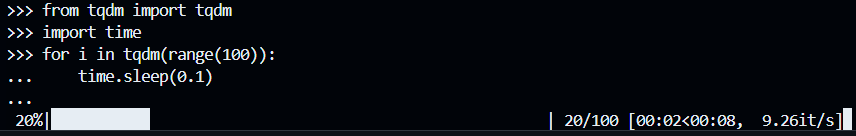
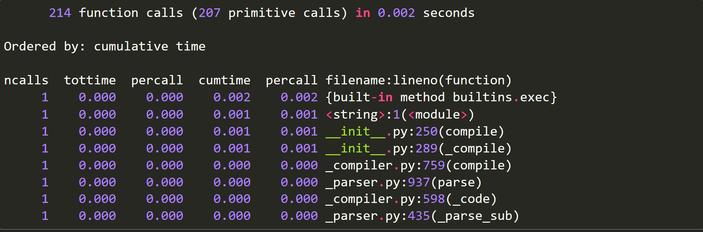
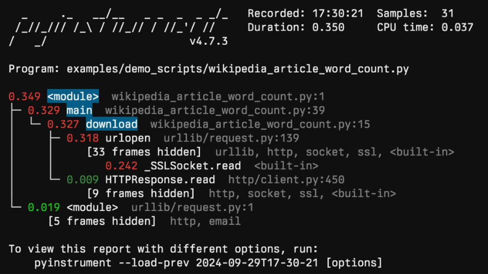
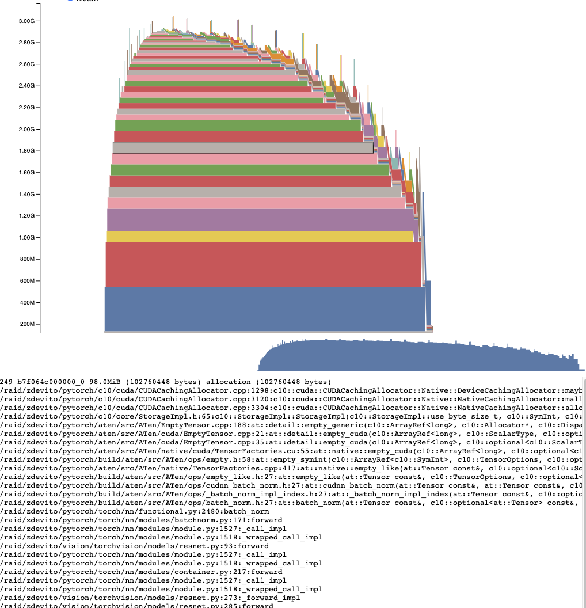

# Best Practices in Python

In questa sezione approfondiremo le *best practices* da seguire nello sviluppo di progetti Python, sottolineando anche l'associazione con Data Analytics.

<!-- New section -->

## Sommario

1. **Gestione delle dipendenze** (pip, poetry, conda, uv)
2. **Strutturazione e creazione di package** (vantaggi, condivisione, cookiecutter)
3. **Metodi di packaging** (setup.py, setup.cfg, pyproject.toml)
4. **Code Quality** (PEP8, linters, ruff, pre-commit)
5. **Tipizzazione** (mypy, typing, gestione exception)
6. **Logging e monitoraggio** (logging, tqdm, wandb)  
7. **Configurazione e gestione parametri** (argparse, file config, Hydra)
8. **Strumenti di profilazione** (pyinstrument, memory-profiler, scalene)

<!-- New section -->

## 1. Gestione delle dipendenze

In Python, per gestire le dipendenze del progetto, si lavora solitamente in ambienti virtuali isolati, così da evitare conflitti e ingombro nel sistema globale.

- **pip**: gestore predefinito di pacchetti in Python, con installazione dall'indice [PyPI](https://pypi.org/).  
- **poetry**: tool più moderno per gestire dipendenze, versioni e creazione di lockfile.  
- **conda**: diffusissimo in ambienti Data Science per la sua facilità d'uso e poca conoscenza di programmazione 
- **uv**: strumento di gestione progetti Python più completa.

<!-- .element: class="fragment" -->

<!-- New subsection -->

Nel panorama dello sviluppo Python, l’uso di ambienti virtuali (virtual environment, spesso in breve _venv_) è **fondamentale**.

Consente di creare un ecosistema isolato per installare librerie e dipendenze, evitando conflitti a livello di sistema o con altri progetti che sfruttano versioni differenti delle stesse librerie.

<!-- .element: class="fragment" -->

<!-- New subsection -->

### Creazione e utilizzo di un venv (virtual environment)

La procedura standard prevede:

1. **Creazione** di un ambiente virtuale:
```bash
python -m venv <nome_venv>
```

questo comando genera una cartella denominata `<nome_venv>` che conterrà l’interprete Python e i pacchetti installati esclusivamente per questo progetto. Tipicamente si scelgono nomi come _venv_ o _.venv_ e useremo questo d'ora in poi per semplicità.

<!-- .element: class="fragment" -->

<!-- New subsection -->

2. **Attivazione** dell'ambiente virtuale:

_Windows_:
```bash
venv\Scripts\activate
```

 _macOS/Linux_:
```bash
source venv/bin/activate
```

Una volta attivato, tutti i comandi di installazione (es. `python` o `pip install`) opereranno su questo ambiente locale.

<!-- .element: class="fragment" -->

<!-- New subsection -->

3. **Disattivazione** dell'ambiente virtuale:
```bash
deactivate
```

Questo comando ha effetto solo all'interno dell'ambiente virtuale e riporta l’utente all’ambiente Python globale.

<!-- .element: class="fragment" -->

<!-- New subsection -->

**Perché è importante?**

- **Isolamento**: non si rischia di creare conflitti con altre installazioni di librerie nel sistema.

<!-- .element: class="fragment" data-fragment-index="1" -->

- **Sperimentazione**: è possibile provare diverse versioni di Python (es. 3.7, 3.8, 3.9) o differenti rilasci di librerie.

<!-- .element: class="fragment" data-fragment-index="2" -->

- **Riproducibilità**: più facile far sì che ogni collaboratore o server di produzione abbia le stesse dipendenze installate.

<!-- .element: class="fragment" data-fragment-index="3" -->

<!-- New subsection -->

### pip (Pip install Package)

**pip** è il gestore di pacchetti di default in Python, permette di installare librerie dal [Python Package Index (PyPI)](https://pypi.org/).

Una volta attivato il venv, possiamo sfruttare i seguenti comandi:

<!-- .element: class="fragment" data-fragment-index="1" -->

- `pip install <nome_pacchetto>`: installa una libreria/pacchetto
- `pip uninstall <nome_pacchetto>`: disinstalla una libreria/pacchetto
- `pip list`: mostra i pacchetti installati nell'ambiente
- `pip freeze > requirements.txt`: per salvare la lista dei pacchetti installati come "lockfile"
- `pip install -r requirements.txt`: per installare i pacchetti da un file di requirements

<!-- .element: class="fragment" data-fragment-index="1" -->

<!-- New subsection -->

### uv: Gestione avanzata dei progetti Python

[uv](https://docs.astral.sh/uv/) è uno strumento creato da _astral-sh_ che fornisce un’esperienza di gestione progetti Python più completa rispetto a pip. 

Con un singolo framework è possibile:

<!-- .element: class="fragment" data-fragment-index="1" -->

- installare versioni diverse di Python e creare l’ambiente virtuale
- gestire ed aggiornare le dipendenze
- eseguire script di build o azioni di packaging

<!-- .element: class="fragment" data-fragment-index="1" -->

In pratica, uv si propone come soluzione “tutto in uno” per la gestione dei progetti. I suoi pregi sono estrema velocità e ottima robustezza agli errori grazie all'implementazione in Rust.

<!-- .element: class="fragment" data-fragment-index="2" -->

<!-- New subsection -->

Le sue *feature* più importanti includono:

1. **Installazione di Python**: provare varie versioni di Python (es. 3.7, 3.8, 3.9) risulta molto più rapido con `uv python install <python-version>`

2. **Gestione progetti Python**: permette di gestire i progetti a 360° gradi, dalla creazione (`uv init`), l'aggiunta e rimozione di dipendenze (`uv add`, `uv remove`), installazione o aggiornamento di tutte le dipendenze (`uv sync`).

3. **Creazione ottimizzata venv**: il comando `uv venv` (o `uv venv --python <python-version>`) creano l'ambiente virtuale che `uv` gestirà. I comandi al punto precedente creano il venv in automatico.

<!-- New subsection -->

4. **Task integrati**: `uv run` è un “task runner” integrato che consente di eseguire script nell'ambiente, sostituendo altri comandi:  
   ```bash
   uv run main.py
   uv run tests
   ```

5. **Supporto a build e packaging**: uv semplifica i passaggi di redistribuzione del codice come la creazione di pacchetti o wheel (.whl) con comandi specifici (`uv build`, `uv publish`), integrando le procedure di packaging definite in `pyproject.toml` o negli strumenti di build moderni.

6. **Compatibilità con la gestione legacy (pip)**: uv mantiene un'interfaccia per l'utilizzo di pip per un controllo a un livello più basso, con `uv pip install`, `uv pip uninstall` o `uv pip list`.

<!-- New section -->

## 2. **Strutturazione e creazione di package**

<!-- New subsection -->

### Strutturare e Creare Package in Python

In Python, organizzare il codice sotto forma di *package* offre innumerevoli vantaggi rispetto a una singola raccolta di script:
- **Manutenibilità**: suddivisione funzionale del codice in moduli e sottopacchetti facilmente gestibili.  
- **Riutilizzo**: funzioni e classi ben incapsulate risultano riutilizzabili in progetti diversi, evitando duplicazioni.  
- **Condivisione**: pubblicazione dei *package* su indici (es. [PyPi](https://pypi.org/)) per condividerli con altri sviluppatori.  
- **Facilità di installazione**: tramite `pip install <nome_pacchetto>` o altri tool (uv/poetry), chiunque può usare il tuo pacchetto.

<!-- New subsection -->

<div class="cols">

<div style="max-height: 400px; min-height: 400px; min-width: 300px" class="pre-no-block pre-no-max-height">

```text
nome_progetto/
├── .venv/
├── src/
│   └── nome_pacchetto/
│       ├── __init__.py
│       ├── modulo1.py
│       ├── modulo2.py
│       └── ...
├── tests/
│   ├── test_modulo1.py
│   └── test_modulo2.py
├── docs/
├── setup.py / pyproject.toml
├── README.md
├── LICENSE
└── .gitignore
```

</div>

<div>

Un layout tipico potrebbe essere:  
- `src/nome_pacchetto/`: contiene effettivamente il package, con `__init__.py` a segnalare a Python che si tratta di un package.
- `tests/`: raccoglie i file di test (unitari, integrazione, ecc.) per garantire una buona copertura del codice.
- `setup.py`/`pyproject.toml`: file di configurazione e metadati del progetto (nome, versioni, dipendenze).

</div>

</div>

<!-- New subsection -->

**Come creare un package**

Python interpreta un package se al suo interno è presente il file `__init__.py`, che può anche essere spesso vuoto.

Quando eseguiamo del codice all'interno di un package, gli script prendono il nome di modulo e bisogna specificare a Python che il file da eseguire fa parte di un package nel modo seguente:

<!-- .element: class="fragment" data-fragment-index="1" -->

```bash
python -m mio_package.sottocartella_package.script_modulo
```

<!-- .element: class="fragment" data-fragment-index="1" -->

<!-- New subsection -->

### Cookiecutter

Per velocizzare la creazione di progetti e adottare strutture standard, si può usufruire di [Cookiecutter](https://github.com/cookiecutter/cookiecutter).

Si tratta di un tool che genera automaticamente i file e le cartelle tipiche dei progetti Python (e non solo) in base a template preconfigurati:

<!-- .element: class="fragment" data-fragment-index="1" -->

```bash
pip install cookiecutter  # qui usiamo pip, ma i creatori consigliano di usare pipx.
cookiecutter https://github.com/audreyfeldroy/cookiecutter-pypackage
```

<!-- .element: class="fragment" data-fragment-index="1" -->

<!-- New subsection -->

Esistono molti template, ognuno con particolarità diverse o specifici per alcuni obiettivi e linguaggi. Cookiecutter facilita la creazione dello scheletro del progetto, completo di setup, test e documentazione.

Il template di esempio nel comando precedente è un template per progetti python che include molti tool, compreso Travis-CI, tox, ma non necessariamente è utile per tutti e potrebbe essere necessario adattarlo al proprio scopo.

<!-- .element: class="fragment" -->

<!-- New section -->

## 3. **Metodi di packaging**

<!-- New subsection -->

Quando si sviluppa un pacchetto Python destinato a essere condiviso o installato, è fondamentale definire correttamente i metadati e le dipendenze. Si può impostare il packaging del progetto con:

1. **setup.py** (senza o con **setup.cfg**)  
2. **pyproject.toml** (metodo più moderno e consigliato)

<!-- New subsection -->

#### setup.py

Tradizionalmente, la configurazione di un progetto Python avveniva tramite questo file. Un semplice esempio:

```python
from setuptools import setup, find_packages

setup(
    name="mio_pacchetto",
    version="0.1.0",
    packages=find_packages(),
    install_requires=[
        "requests",
        "numpy",
    ],
)
```
Dopodiché, per installare il progetto in locale si poteva eseguire `pip install .` o `python setup.py install`.

<!-- New subsection -->

#### pyproject.toml

Oggi lo standard più raccomandato è usare **pyproject.toml**, introdotto dalla [PEP 518](https://peps.python.org/pep-0518/). È un file TOML che racchiude le informazioni di build, i metadati e le dipendenze del progetto, consentendo ad altri tool (come uv) di gestire la build in modo unificato.

<!-- New subsection -->

Il seguente è un esempio di pyproject.toml:

```ini
[project]
name = "mio_pacchetto"
version = "0.1.0"
description = "Un pacchetto base per esempio"
authors = [
  { name="Mario Rossi", email="mario.rossi@example.com" }
]
dependencies = [
  "requests",
  "numpy"
]

[project.optional-dependencies]
extra1 = ["numpy==2.1.2"]
extra2 = ["numpy==2.0.0"]

[build-system]
requires = ["setuptools", "wheel"]
build-backend = "setuptools.build_meta"

[tool.uv]
conflicts = [
    [{ extra = "extra1" }, { extra = "extra2" }]
]
```

<!-- New subsection -->

L'esecuzione di `uv sync` esegue in automatico la lettura del contenuto di pyproject.toml per installare le dipendenze. Questo processo genera un **lockfile**.

Un **lockfile** cattura esattamente le versioni dei pacchetti installati nel progetto, garantendo una riproducibilità precisa dell’ambiente.

<!-- .element: class="fragment" -->

Rispetto al classico requirements.txt, un lockfile conserva i vincoli esatti (inclusi eventuali sotto-dipendenze), evitando sorprese se un pacchetto rilascia una nuova versione che potrebbe non essere compatibile.

<!-- .element: class="fragment" -->

<!-- New subsection -->

Un lockfile, così come i requirements.txt, non è sufficiente per la distribuzione e condivisione del codice. Per questo motivo esistono i processi di **build** e **publish** del codice.

Una volta configurato il nostro progetto in pyproject.toml, possiamo creare un distributable in formato wheel.

<!-- .element: class="fragment" -->

<!-- New subsection -->

**Metodo tradizionale** (con twine):
```bash
python -m build  # crea la cartella dist/
twine upload dist/*
```

**Metodo consigliato** con uv tramite comandi più immediati:

<!-- .element: class="fragment" data-fragment-index="1" -->

```bash
uv build   # genera la wheel
uv publish # pubblica direttamente su PyPi
```

<!-- .element: class="fragment" data-fragment-index="1" -->

Questi comandi si appoggiano ai metadati definiti in **pyproject.toml**, inclusa la versione e lo strumento di build.

<!-- .element: class="fragment" data-fragment-index="2" -->

<!-- New section -->

## 4. **Code Quality**

<!-- New subsection -->

Garantire una *code quality* elevata significa adottare convenzioni di stile uniformi, automatizzare controlli alla ricerca di errori e prevenire bug. Una base imprescindibile è rispettare la [PEP8](https://peps.python.org/pep-0008/), documentazione che definisce lo stile raccomandato per il codice Python.

<!-- New subsection -->

### Convenzioni di formattazione

[PEP8](https://peps.python.org/pep-0008) (Python Enhancement Proposal) rappresenta la guida stilistica di Python per
eccellenza che viene aggiornata continuamente con nuove convenzioni o quando precedenti convenzioni diventano obsolete. 

PEP8 racchiude linee guida su indentazione (4 spazi), lunghezza massima delle righe (79-88 caratteri), convenzioni di naming (CamelCase per le classi, minuscole_con_underscore per funzioni/variabili), gestione di import, spazi bianchi.

<!-- .element: class="fragment" --> 

[PEP257](https://peps.python.org/pep-0257/) si focalizza sulle docstrings.

<!-- .element: class="fragment" --> 

<!-- New subsection -->

### Formatter: Black

[Black](https://github.com/psf/black) è un formatter supportato dalla Python Software Foundation (PSF) che si occupa di allineare il codice alla PEP8 in modo automatico:
```bash
pip install black
black <file_o_directory>
```

L’idea è che i programmatori non sprechino tempo nel discutere dettagli di stile, delegandone la responsabilità a uno strumento automatico.

<!-- .element: class="fragment" --> 

<!-- New subsection -->

### Linters

*Lint* sono i filaccetti di tessuto che fuoriscono dai vestiti.

I linter rilevano i difetti (i filaccetti) del codice per correggerli (o consigliarci di correggerli).

La maggior parte dei linters si possono suddivider in **logici** e **stilistici**. Quelli **logici** rilevano piccoli errori o risultati non previsti. Quelli **stilistici** rilevano il codice non formattato secondo convenzioni specifiche.

<!-- .element: class="fragment" -->

<!-- New subsection -->

### Esempi di Linters

- [Ruff](https://docs.astral.sh/ruff/) (logico e stilistico)
- [Pylint](https://www.pylint.org/) (logico e stilistico)
- [PyFlakes](https://github.com/PyCQA/pyflakes) (logico)
- [pycodestyle](https://github.com/PyCQA/pycodestyle) (stilistico)
- [Flake8](https://flake8.pycqa.org/) (unione di linter logici e stilistici)
- [Pylama](https://github.com/klen/pylama) (unione di linter logici e stilistici)
- ...

<!-- New subsection -->

### Ruff

**Ruff** è un linter e formatter di nuova generazione, scritto in Rust, che integra molte funzionalità di tool diversi (Flake8, isort, ecc.), diventando una soluzione _all-in-one_.

- Elevata **velocità** di esecuzione (anche su progetti molto ampi)
- Configurazione personalizzata via `pyproject.toml` o `ruff.toml`
- Controllo di import non utilizzati, formatting base, best practice sintattiche

<!-- .element: class="fragment" -->

<!-- New subsection -->

Il [linter di Ruff](https://docs.astral.sh/ruff/linter/) può essere usato con i seguenti comandi:
- ```ruff check```: lint i file nella directory attuale
- ```ruff check --fix```: corregge gli errori correggibili
- ```ruff check --watch```: lint i file a ogni modifica
- ```ruff check <file_o_directory>```: lint il file o i file nella directory

<!-- New subsection -->

Il rapidissimo [formatter di Ruff](https://docs.astral.sh/ruff/formatter/) rappresenta un sostituto completo di Black che può essere usato con i seguenti comandi:
- ```ruff format```: formatta i file nella directory attuale
- ```ruff format <file_o_directory>```: formatta il file o i file nella directory

<!-- New subsection -->

> Dimostrazione di Ruff  
> [Ruff Playground](https://play.ruff.rs/)

<!-- New subsection -->

### Altri strumenti di supporto alla code quality

Esistono altri tool per il supporto allo sviluppo di software di qualità.

- [mccabe](https://github.com/PyCQA/mccabe): controlla la complessità ciclomatica (McCabe, 1976) del software
- [pre-commit](https://pre-commit.com/): tool per eseguire dei plug-in (es. linters) prima di un comando `git commit`

<!-- New subsection -->

### pre-commit

[pre-commit](https://pre-commit.com/) è un framework che permette di eseguire controlli e formattazioni _prima_ del commit `git`. In pratica, si configura un file `.pre-commit-config.yaml` che elenca i vari “hook” (script o comandi) da lanciare automaticamente quando il developer esegue `git commit`.

In questo modo:

<!-- .element: class="fragment" data-fragment-index="1" -->

- Non si dimentica mai di lanciare i controlli di stile e i linters
- Eventuali errori di formattazione o difetti logici vengono segnalati prima di sottomettere il commit

<!-- .element: class="fragment" data-fragment-index="1" -->

<!-- New subsection -->

Un esempio minimo di `.pre-commit-config.yaml` potrebbe essere:
```yaml
repos:
  - repo: https://github.com/psf/black
    rev: 23.3.0
    hooks:
      - id: black
        language_version: python3

  - repo: https://github.com/charliermarsh/ruff-pre-commit
    rev: v0.0.268
    hooks:
      - id: ruff
        args: ["--fix"]
```

<!-- New subsection -->

Dopo aver creato il file, si installa pre-commit nel repo locale:
```bash
pip install pre-commit
pre-commit install
```

A questo punto, ogni volta che si effettua un `git commit`, i file modificati verranno controllati e formattati da Black e da Ruff se necessario. Se un hook fallisce, il commit viene automaticamente annullato, costringendo lo sviluppatore a correggere, ri-aggiungere i file e rifare il commit.

<!-- .element: class="fragment" -->

<!-- New section -->

## 5. **Tipizzazione**

<!-- New subsection -->

La **tipizzazione** in Python permette di aggiungere annotazioni di tipo al codice, garantendo una migliore leggibilità e permettendo ai tool di analisi statica di individuare errori in fase di sviluppo, prima dell’esecuzione.

Le annotazioni si specificano con la sintassi `variabile: Tipo` o `def funzione(arg: Tipo) -> Tipo Ritorno:`. Ad esempio:

<!-- .element: class="fragment" data-fragment-index="1" -->

```python
def saluta(nome: str) -> str:
    return f"Ciao, {nome}"
```

<!-- .element: class="fragment" data-fragment-index="1" -->

<!-- New subsection -->

### Typing

Il modulo builtin `typing` fornisce molti tipi. Per quelli di base il tipo di dato può essere usato per rappresentare il tipo stesso in versioni recenti:

- `list[int]` per liste di interi (`List[int]` in precedenti versioni).
- `dict[str, int]` per dizionari con chiave stringa e valore intero (`Dict[str, int]` in precedenti versioni).
- `Union[str, int]` (o `str` o `int`) per funzioni con parametri o valori di ritorno “ibridi”.
- `Optional[int]` equivalente a `Union[int, None]`.
- `tuple[int, int]` per una tupla di 2 interi (`Tuple[int, int]` in precedenti versioni). Come valore di ritorno, indica che vengono restituiti 2 valori interi.

<!-- New subsection -->

Vantaggi:

- **Leggibilità**: chi legge il codice sa già che tipo di dati aspettarsi o restituire.
- **Strumenti statici**: prevengono bug rilevando incompatibilità tra i tipi.
- **IDE Completion**: gli IDE (Visual Studio Code, PyCharm) possono suggerire completamenti più precisi.

<!-- New subsection -->

### Mypy

[mypy](http://mypy-lang.org/) è il tool più diffuso per il _type checking_ statico in Python. Esegue un’analisi del codice e segnala eventuali situazioni di mismatch tra tipi dichiarati e uso effettivo.

Installazione e utilizzo tipici:

<!-- .element: class="fragment" data-fragment-index="1" -->

```bash
pip install mypy
mypy nomefile.py
```

<!-- .element: class="fragment" data-fragment-index="1" -->

<!-- New subsection -->

Esempio:
```python
def add_numbers(a: int, b: int) -> int:
    return a + b

x = add_numbers("10", 20)  # Errore rilevato da mypy
```
Mypy segnala che il primo argomento è `str` anziché `int`. Questo permette di trovare bug prima ancora di eseguire il codice.

- `mypy --strict`: abilita controlli più severi (verifiche su variabili senza tipo, ecc.).
- configurazione via `mypy.ini` o sezione `[tool.mypy]` di `pyproject.toml`.

<!-- .element: class="fragment" data-fragment-index="1" -->

<!-- New subsection -->

### Altri tool di type checking

- [Pyright](https://github.com/microsoft/pyright): sviluppato da Microsoft, è un type checker veloce scritto in TypeScript. Spesso integrato nell’estensione “Pylance” di Visual Studio Code.
- [pyre](https://pyre-check.org/): è un type checker scritto in OCaml and ottimizzato per la performance.
- [pytype](https://github.com/google/pytype): è un type checker che controlla e inferisce il tipo per codice senza tipi annotati.

<!-- New section -->

## 6. **Logging e monitoraggio**

Quando si sviluppano applicazioni in Python, un buon sistema di logging e strumenti di monitoraggio aiutano a tracciare l’esecuzione e a diagnosticare eventuali problemi, specialmente in ambito Data Analytics e Machine/Deep Learning.

<!-- New subsection -->

### Logging con la libreria standard

Python fornisce un modulo di logging integrato, configurabile a più livelli (DEBUG, INFO, WARNING, ERROR, CRITICAL).

Un esempio minimo:

<!-- .element: class="fragment" data-fragment-index="1" -->

```python
import logging

logging.basicConfig(level=logging.INFO)

logging.info("Questo è un messaggio di Info")
logging.error("Questo è un messaggio di Errore")
```

<!-- .element: class="fragment" data-fragment-index="1" -->

<!-- New subsection -->

Il modulo `logging` in Python offre la possibilità di personalizzare ulteriormente la configurazione del log tramite *handler* e *formatter*. 

- Un **handler** specifica “dove” vogliamo inviare i messaggi di log (console, file, email, syslog, ecc.).  
- Un **formatter** definisce il formato del messaggio (incluso timestamp, livello del log, nome del modulo, testo dell’evento).

<!-- New subsection -->

```python
# Creiamo un handler che invia il log su console
console_handler = logging.StreamHandler()
console_handler.setLevel(logging.INFO)

# Creiamo un handler che invia il log su file
file_handler = logging.FileHandler("app.log")
file_handler.setLevel(logging.DEBUG)

# Definiamo il formatter con informazioni dettagliate
formatter = logging.Formatter(
    "[%(asctime)s] [%(name)s] [%(levelname)s] %(message)s",
    datefmt="%Y-%m-%d %H:%M:%S"
)

# Assegniamo il formatter a entrambi gli handler
console_handler.setFormatter(formatter)
file_handler.setFormatter(formatter)

# Aggiungiamo gli handler al logger
logger.addHandler(console_handler)
logger.addHandler(file_handler)
```

<!-- New subsection -->

### Altri tool di logging: Loguru

[Loguru](https://github.com/Delgan/loguru) è una libreria third-party che semplifica la gestione dei log in Python, ponendosi come alternativa al modulo standard `logging`. Principalmente, mira a togliere la necessità di configurazioni manuali di logger, handler, formatter e filtri in modo ripetitivo.

- **Semplicità di inizializzazione**: fornisce un logger pre-configurato pronto all'uso, senza dover creare `Logger`, `Handler` o `Formatter`.  
- **Formattazione predefinita**: offre di default un formato semplice con inclusi timestamp e livello.  
- **Rotazione automatica**: “rotazioni” per scartare messaggi di log sulla base della dimensione del file, data o numero di backup.  
- **Stack trace migliorati**: eccezioni con stack trace colorate e leggibili.  
- **Filtri immediati**: filtrare i log a livello di singola funzione o modulo.

<!-- New subsection -->


<!-- New subsection -->

### Monitoraggio del progresso con tqdm

**tqdm** è una libreria che mostra barre di progresso e stime di completamento quando si itera su elementi di una lista, un file o altri oggetti iterabili.

<!-- New subsection -->

```python
from tqdm import tqdm
import time
for i in tqdm(range(100)):
    time.sleep(0.1)
```



<!-- .element: class="fragment" data-fragment-index="1" -->

<!-- New subsection -->

[Weights & Biases](https://wandb.ai/site) è un servizio pensato per il tracciamento di esperimenti e la visualizzazione di metriche in ambito Machine/Deep Learning.

Alcune funzionalità chiave:

<!-- .element: class="fragment" data-fragment-index="1" -->

- **Tracciamento parametri e metriche**: salvataggio di learning rate, batch size, epoch, accuracy, loss e ogni altra statistica necessaria.
- **Dashboard online**: visualizzazione in tempo reale di curve di apprendimento, confusione matrix e comparazione fra run differenti.
- **Backup modelli**: archivio versioni dei modelli addestrati e ripristino immediato.

<!-- .element: class="fragment" data-fragment-index="1" -->

<!-- New subsection -->

Il seguente è un esempio di utilizzo semplificato in un contesto di addestramento di un modello ML/DL:

```python
import wandb

wandb.init(project="experiment-xyz")

wandb.config.learning_rate = 0.001
wandb.config.batch_size = 32

for epoch in range(10):
    # esecuzione addestramento ...
    wandb.log({"epoch": epoch, "loss": current_loss, "accuracy": current_accuracy})
```

alla fine dell'esecuzione, wandb mostrerà un resoconto dei parametri ed eseguirà l'upload della run e dei dati associati ad essa.

<!-- .element: class="fragment" data-fragment-index="1" -->

<!-- New subsection -->

In ambienti di Machine/Deep Learning, un log esaustivo dei parametri e delle metriche risulta essenziale per confrontare esperimenti, replicare risultati e valutare miglioramenti.

> Dimostrazione Weights & Biases (wandb)
> [Report pubblico d'esempio](https://wandb.ai/stacey/saferlife/reports/SafeLife-Benchmark-Experiments--Vmlldzo0NjE4MzM)

<!-- .element: class="fragment" data-fragment-index="1" -->

<!-- New section -->

## 7. **Configurazione e gestione parametri**

<!-- New subsection -->

Spesso è controproducente “fissare” i valori dei parametri direttamente nel codice (hardcoded). Parametri come percorsi di file, indirizzi di database o iperparametri di modelli di Machine Learning possono (e dovrebbero) essere definiti esternamente, per rendere il software:
- **Dinamico**: non serve modificare il codice ogni volta che cambia un parametro.  
- **Riproducibile**: salvando i parametri in configurazioni, chiunque può replicare esattamente le stesse condizioni di esecuzione.  
- **Scalabile**: è più semplice automatizzare multiple esecuzioni cambiando solo pochi valori in un file di config.

<!-- New subsection -->

### argparse

La libreria [argparse](https://docs.python.org/3/library/argparse.html) (inclusa nella standard library) facilita la definizione di opzioni da riga di comando, rendendo l’esecuzione del programma parametrizzabile.

Una volta configurato possiamo usare il nostro script nel modo seguente:

<!-- .element: class="fragment" data-fragment-index="1" -->

```bash
python main.py --input_files mydata1.csv mydata2.csv --epochs 20 --activation_func gelu
```

<!-- .element: class="fragment" data-fragment-index="1" -->

<!-- New subsection -->

La cui definizione è la seguente:

<div class="pre-no-max-height">

```python
from argparse import ArgumentParser as parser

def main():
    parser(description="Esempio di parametri da CLI")
    parser.add_argument(
        "--input_files", type=str, default="dataset.csv",
        nargs='+', help="Uno o più percorsi ai file di input"
    )
    parser.add_argument("--epochs", type=int, default=10, help="Numero di epoche di training")
    parser.add_argument(
        "--activation_func", type="str", choices=["relu","gelu"],
        default="relu", help="Funzione di attivazione"
    )

    args = parser.parse_args()

    print(f"File di input: {args.input_files}")
    print(f"Epoche: {args.epochs}")

if __name__ == "__main__":
    main()
```

</div>

<!-- New subsection -->

### File di configurazione (yaml, ini, json)

Se i parametri diventano numerosi o complicati, è spesso preferibile un file di configurazione (es. .yaml, .ini o .json).

Vantaggi:

<!-- .element: class="fragment" data-fragment-index="1" -->

- **Organizzazione**: parametri divisi in sezioni (config di sistema, config di modello, credenziali, ecc.).
- **Versionamento**: i file config possono essere inclusi nel repository Git per condividere setup predefiniti.
- **Facilità di modifica**: non è necessario toccare il codice sorgente, basta aprire il file di config.

<!-- .element: class="fragment" data-fragment-index="1" -->

<!-- New subsection -->

```yaml
model:
  epochs: 30
  batch_size: 64
data:
  input_file: "data/train.csv"
  validation_file: "data/val.csv"
logging:
  level: "INFO"
```

```python
import yaml

with open("config.yaml", "r") as f:
    config = yaml.safe_load(f)

epochs = config["model"]["epochs"]
batch_size = config["model"]["batch_size"]
```

<!-- New subsection -->

### Altri Tool di Configurazione

Oltre ad `argparse` e ai classici file di configurazione (`.yaml`, `.ini`, `.json`), esistono framework pensati per gestire configurazioni complesse e modulari. Due di questi sono [Hydra](https://hydra.cc/) e [OmegaConf](https://omegaconf.readthedocs.io/), che spesso si usano in sinergia, ma possono funzionare separatamente.

<!-- New subsection -->

**Hydra**  
   - Gestisce più *file di configurazione* (YAML) unendoli tramite composizione in un’unica super-config.  
   - Permette l’override a riga di comando, variando parametri come `model.epochs=50 data.input_file="otherdata.csv"`.  
   - Gestisce plugin e integrazioni per job in parallelo o su cluster.

**OmegaConf**  
   - Dizionari/liste flessibili con `DictConfig` e `ListConfig`.  
   - Include meccanismi di interpolazione, utili per evitare doppioni (ad es. `lr: ${model.learning_rate}`).  
   - Hydra lo usa nativamente, ma può essere usato anche da solo.

<!-- .element: class="fragment" data-fragment-index="1" -->

<!-- New subsection -->

Esempio di utilizzato di Hydra e OmegaConf:

```python
import hydra
from omegaconf import DictConfig, OmegaConf

@hydra.main(version_base=None, config_path=".", config_name="config")
def main(cfg: DictConfig):
    print(f"Epoche: {cfg.training.epochs}")
    print(f"Learning rate: {cfg.training.lr}")
    print(f"File di input: {cfg.data.input_file}")
    print(OmegaConf.to_yaml(cfg))

if __name__ == "__main__":
    main()
```

<!-- New section -->

## 8. **Strumenti di profilazione**

Ottimizzare le prestazioni di un’applicazione Python richiede di capire quali parti del codice richiedono più tempo o consumano più memoria. Esistono svariati strumenti *profiler* per identificare punti critici e colli di bottiglia (_bottleneck_).

<!-- New subsection -->

### Profilazione temporale

[cProfile](https://docs.python.org/3/library/profile.html) è un profiler built-in di Python. Sebbene fornisca tempi dettagliati e un'estesa interfaccia, può essere verboso e limitato.



<!-- New subsection -->

[pyinstrument](https://github.com/joerick/pyinstrument) è un profiler “sampling-based”, quindi anziché tracciare ogni singolo evento (come **cProfile**), prende “istantanee” periodiche dello stack, fornendo report più sintetici e immediati. Non è altamente ottimizzato e non offre funzionalità avanzate come altri tool, ma rappresenta una semplice soluzione.

<!-- New subsection -->

<div class="cols">

<div>

Installazione e utilizzo base:

```bash
pip install pyinstrument
pyinstrument myscript.py
```

</div>

<div>

Utilizzato direttamente sugli script come nell'esempio, restituisce un output colorato, evidenziando le porzioni più lente.



</div>

</div>

<!-- New subsection -->

Nei contesti di Machine/Deep Learning sono anche utili tool più specializzati, come [PyTorch Profiling](https://pytorch.org/tutorials/recipes/recipes/profiler_recipe.html).

<!-- New subsection -->

Esempio d'uso e output:

```python
import torch
from torch.profiler import profile, record_function, ProfilerActivity

with profile(
    activities=[ProfilerActivity.CPU],
    profile_memory=True
) as prof:
    model(inputs)

print(prof.key_averages().table(sort_by="cpu_memory_usage"))
```

```json
---------------------------------  ------------  ------------  ------------
                             Name       CPU Mem  Self CPU Mem    # of Calls
---------------------------------  ------------  ------------  ------------
                      aten::empty      94.79 Mb      94.79 Mb           121
                 aten::batch_norm      47.41 Mb           0 b            20
                     aten::conv2d      47.37 Mb           0 b            20
                 aten::max_pool2d      11.48 Mb           0 b             1
    aten::max_pool2d_with_indices      11.48 Mb      11.48 Mb             1
---------------------------------  ------------  ------------  ------------
Self CPU time total: 53.064ms
```

<!-- New subsection -->

### Profilazione spaziale

In Python non c'è una libreria nativa per monitorare l'uso della memoria durante l'esecuzione di codice. Questo tipo di profilazione è utile specialmente in casi d'uso che riportano un'eccessiva generazione di oggetti oppure quando è necessario ridurre al minimo l'uso della memoria (es. programmi embedded).

<!-- New subsection -->

[memory-profiler](https://github.com/pythonprofilers/memory_profiler) è uno strumento che consente di tracciare l’uso della memoria per singola riga di codice. Si integra con uno speciale decoratore @profile, ma il progetto non è più mantenuto.

```python
@profile
def heavy_function():
    data = [x for x in range(10**7)]
    return sum(data)

if __name__ == "__main__":
    heavy_function()
```

se eseguito con `python -m memory_profiler main.py` non necessita l'import di `profile`.

<!-- New subsection -->

Come PyTorch Profiler, PyTorch fornisce anche dei tool più precisi per esplorare l'[uso della memoria CUDA](https://pytorch.org/docs/stable/torch_cuda_memory.html). Il tool registra lo storico dell'uso della memoria e crea uno snapshot che può essere visualizzato tramite un'interfaccia web dedicata.

<!-- New subsection -->

Esempio d'uso e output:

<div class="cols">

```python
import torch

torch.cuda.memory._record_memory_history()

run_your_code()
torch.cuda.memory._dump_snapshot("my_snapshot.pickle")
```



</div>

<!-- New subsection -->

### Scalene: eccellente soluzione unica

[Scalene](https://github.com/plasma-umass/scalene) è un profiler ad alte prestazioni, specializzato sia nell’analisi temporale che spaziale su CPU e GPU a livello di singola linea di codice.  
Scalene utilizza un approccio **sampling-based** estremamente ottimizzato e fornisce informazioni dettagliate sulla percentuale di tempo spesa in CPU, GPU e sull’utilizzo della memoria, evidenziando la porzione di codice responsabile di un carico eccessivo.  

Offre inoltre funzionalità di **profilazione multithread** e **adattamento dinamico**, senza introdurre overhead significativo sulle prestazioni. Le analisi eseguite dagli autori dimostrano una maggior disponibilità di funzioni, esecuzione rapida e precisione nei tempi riportati.

<!-- .element: class="fragment" data-fragment-index="1" -->

<!-- New subsection -->

Similmente ad altri tool, può essere usato da linea di comando nel modo seguente:

```bash
scalene your_prog.py                     # profilo completo con interfaccia web
scalene --cpu your_prog.py               # profila solo CPU
scalene --reduced-profile your_prog.py   # profile solo righe più onerose
```

Alla fine del processo, creerà un'interfaccia web interattiva per permettere all'utente di esplorare i dati di profilazione estratti da scalene, a meno che non venga passato il parametro `--cli` per restituire l'output sul terminale.

<!-- New subsection -->

Può anche essere usato all'interno del codice per profilare solo certe sezioni:

```python
from scalene import scalene_profiler

scalene_profiler.start()

# codice da profilare

scalene_profiler.stop()
```

opppure decorando le funzioni senza importare la libreria ed eseguendo con Scalene:

<!-- .element: class="fragment" data-fragment-index="1" -->

```python
# do not import profile!

@profile
def slow_function():
    import time
    time.sleep(3)
```

<!-- .element: class="fragment" data-fragment-index="1" -->
